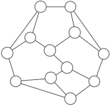
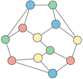

Given an undirected graph ↴ with maximum degree ↴ DD, find a graph coloring ↴ using at most D+1D+1 colors.

For example:



First described by Robert Frucht in 1939, the Frucht graph is a 3-regular graph with 12 vertices, 18 edges, and no nontrivial symmetries.
This graph's maximum degree (D) is 3, so we have 4 colors (D+1). Here's one possible coloring:



The Frucht graph with legal coloring.
Graphs are represented by an array of N node objects, each with a label, a set of neighbors, and a color:

```javascript
class GraphNode {
    constructor(label) {
        this.label = label
        this.neighbors = new Set()
        this.color = null
    }
}

const a = new GraphNode('a')
const b = new GraphNode('b')
const c = new GraphNode('c')

a.neighbors.add(b)
b.neighbors.add(a)
c.neighbors.add(b)
b.neighbors.add(c)

const graph = [a, b, c]
```
