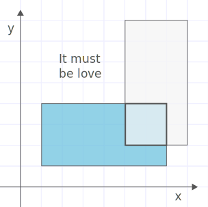

A crack team of love scientists from OkEros (a hot new dating site) have devised a way to represent dating profiles as rectangles on a two-dimensional plane.

They need help writing an algorithm to find the intersection of two users' love rectangles. They suspect finding that intersection is the key to a matching algorithm so powerful it will cause an immediate acquisition by Google or Facebook or Obama or something.

Two rectangles overlapping a little. It must be love.
Write a function to find the rectangular intersection of two given love rectangles.

As with the example above, love rectangles are always "straight" and never "diagonal." More rigorously: each side is parallel with either the x-axis or the y-axis.

They are defined as objects ↴ like this:

  const myRectangle = {

  // Coordinates of bottom-left corner
  leftX: 1,
  bottomY: 1,

  // Width and height
  width: 6,
  height: 3,
};

Your output rectangle should use this format as well.